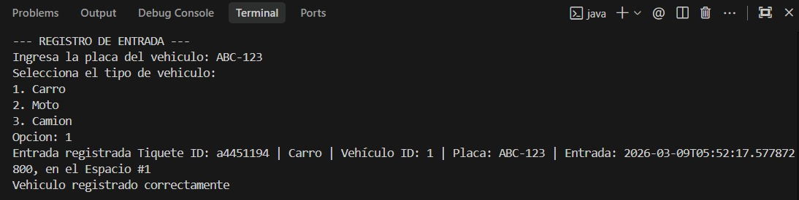
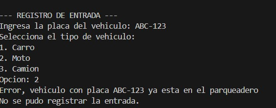
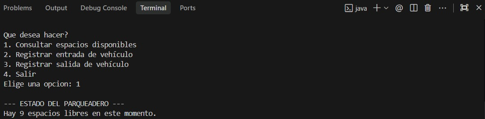
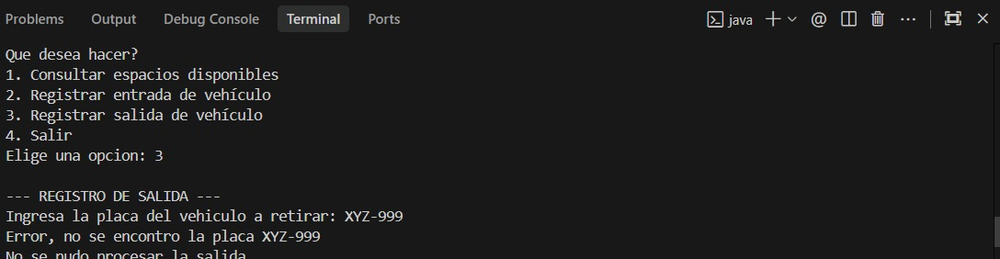
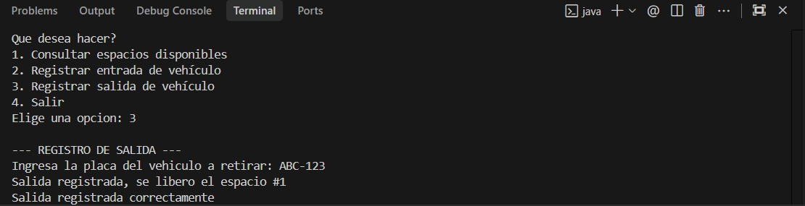

# Parqueadero
Parqueadero
Sistema que simula parqueadero para afianzar conceptos de POO en Java 🚗🅿️

# Parqueadero - Mini Proyecto Integrador POO en Java

Sistema de gestión de parqueadero por consola, desarrollado en Java, para evidenciar conceptos de Programación Orientada a Objetos: relaciones entre clases, encapsulamiento, herencia, polimorfismo, clase abstracta, interfaz y uso de `static`.

## 1. Objetivo del proyecto

Desarrollar una aplicación por consola que permita administrar un parqueadero, registrando entradas y salidas de vehículos, consultando espacios disponibles y calculando el costo del servicio según el tiempo de permanencia.

Este proyecto adapta el dominio propuesto de biblioteca al dominio de parqueadero, conservando los conceptos obligatorios solicitados en la guía.

---

## 2. Funcionalidades principales

- Registrar entrada de vehículos
- Registrar salida de vehículos
- Buscar vehículo por placa
- Consultar espacios disponibles
- Consultar todos los espacios
- Ver tiquetes activos
- Calcular tarifa según tiempo de permanencia

---

## 3. Estructura del proyecto

src/
 ├── model/
 │    ├── Vehiculo.java
 │    ├── Carro.java
 │    ├── Moto.java
 │    ├── Camion.java
 │    ├── Espacio.java
 │    ├── Parqueadero.java
 │    ├── Tiquete.java
 │    ├── DetalleTiquete.java
 │    └── Registrable.java
 │
 ├── service/
 │    └── ParqueaderoService.java
 │
 ├── util/
 │    └── CalculadoraTarifa.java
 │
 └── app/
      └── App.java

# 4. Cumplimiento de conceptos POO
## 4.1 Relaciones entre clases
### a) Uso (Dependency)

### La clase ParqueaderoService utiliza la clase CalculadoraTarifa para calcular el costo del parqueo al momento de registrar la salida de un vehículo.

### Ejemplo:
### CalculadoraTarifa.calcularCosto(...)

## b) Asociación

### La clase Tiquete está asociada con Vehiculo, ya que cada tiquete pertenece a un vehículo específico.

## c) Agregación

### La clase Parqueadero agrega una lista de objetos Espacio.
### Los espacios forman parte del parqueadero, pero conceptualmente pueden identificarse como elementos de su estructura.

## d) Composición

### La clase Tiquete compone un objeto DetalleTiquete, porque el detalle del tiempo y costo tiene sentido únicamente dentro del contexto del tiquete generado.

## 4.2 Encapsulamiento, visibilidad y control de acceso

### Se usan atributos private para proteger el estado interno de varias clases.

### Se usan getters para acceder de forma controlada a la información.

### En Vehiculo se usa protected para permitir acceso a las subclases.

## Se realizan validaciones dentro de métodos del servicio, por ejemplo:

### placa nula o vacía

### vehículo nulo

### placa duplicada en vehículos activos

### ausencia de espacios disponibles

### Esto evita inconsistencias y protege la lógica del sistema.

## 4.3 Herencia

## #Se implementó una jerarquía de vehículos:

### Vehiculo (clase base abstracta)

### Carro

### Moto

### Camion

### Cada subclase hereda atributos comunes como id y placa, y redefine su comportamiento para el cálculo de tarifa base.

## 4.4 Polimorfismo

### El polimorfismo se evidencia porque Carro, Moto y Camion son tratados como objetos de tipo Vehiculo, pero cada uno responde de manera distinta al método calcularTarifaBase().

### Esto permite trabajar con una abstracción común y cambiar el comportamiento según el tipo real del objeto.

## 4.5 Clase abstracta

### La clase Vehiculo es abstracta porque representa un concepto general que no debe instanciarse directamente.

## Incluye:

### atributos comunes: id, placa

### método abstracto: calcularTarifaBase()

### Esto obliga a que cada tipo de vehículo implemente su propia tarifa base.

## 4.6 Interfaz

### Se implementó la interfaz Registrable, aplicada a la clase Espacio.

### La interfaz define operaciones relacionadas con el registro de entrada y salida en un espacio del parqueadero, lo cual permite separar el contrato del comportamiento concreto.

## 4.7 Uso de static

## Se usa static en varios casos:

### contadorId en Vehiculo para generar identificadores consecutivos

### métodos y constantes utilitarias en CalculadoraTarifa

### patrón Singleton en Parqueadero mediante getInstance()

## 5. Diagrama UML

### El proyecto incluye el diagrama UML en la carpeta:

#### /docs/parqueaderoUML.png

## 6. Instrucciones de compilación y ejecución

## Compilar
### javac -d out $(find src -name "*.java")

## Ejecutar
### java -cp out app.App

## Casos de Prueba Manuales

A continuación se detallan 5 casos de prueba manuales diseñados para verificar el correcto funcionamiento del sistema completo (integrando Model, Service, Util y UI).

### Caso de Prueba 1: Registro Exitoso de Entrada (Carro)
**Objetivo:** Verificar que el sistema permite registrar exitosamente un carro que ingresa por primera vez y le asigna un espacio físico y un tiquete.
* **Precondiciones:** El sistema debe estar corriendo y deben existir espacios disponibles (10 al iniciar).
* **Pasos de Ejecución:**
  1. En el menú principal, seleccionar la opción **2** ("Registrar entrada de vehículo").
  2. Cuando el sistema lo solicite, ingresar la placa: `ABC-123`.
  3. Seleccionar la opción **1** para indicar que el tipo de vehículo es "Carro".
* **Resultado Esperado:** 
  - El sistema muestra el mensaje: `Entrada registrada Tiquete ID: [código único] | Carro | Vehículo ID: 1 | Placa: ABC-123 | Entrada: [fecha y hora], en el Espacio #1`.
  - El sistema muestra el mensaje final: `Vehiculo registrado correctamente`.

  

### Caso de Prueba 2: Intento de Ingreso con Placa Duplicada 
**Objetivo:** Validar que el sistema impida el registro de entrada doble de la misma placa antes de que el vehículo haya registrado su salida.
* **Precondiciones:** Haber ejecutado exitosamente el **Caso de Prueba 1** (el carro con placa `ABC-123` está activo en el parqueadero).
* **Pasos de Ejecución:**
  1. En el menú principal, seleccionar nuevamente la opción **2** ("Registrar entrada de vehículo").
  2. Ingresar exactamente la misma placa: `ABC-123`.
  3. Seleccionar la opción **2** para indicar que el tipo de vehículo es "Moto".
* **Resultado Esperado:** 
  - El sistema detecta la duplicidad y muestra el error: `Error, vehiculo con placa ABC-123 ya esta en el parqueadero`.
  - Se muestra el mensaje: `No se pudo registrar la entrada.`
  - No se toma ningún espacio adicional ni se genera un nuevo tiquete.

  

### Caso de Prueba 3: Consultar Espacios Disponibles Actualizados
**Objetivo:** Corroborar que la cantidad de espacios decrece al registrar vehículos y coincide con el estado logico del parqueadero.
* **Precondiciones:** Haber ejecutado el **Caso de Prueba 1** (Hay 1 solo auto en el parqueadero. Dado que el sistema tiene 10 por defecto, deberían quedar 9 libres).
* **Pasos de Ejecución:**
  1. En el menú principal, seleccionar la opción **1** ("Consultar espacios disponibles").
* **Resultado Esperado:** 
  - El sistema debe listar los espacios y arrojar un resumen: `Hay 9 espacios libres en este momento.`
  - Esto valida que la lógica de ocupación del modelo base de datos (List de Espacios) funciona correctamente.

  

### Caso de Prueba 4: Intento de Salida con Placa Inexistente
**Objetivo:** Evidenciar que el sistema maneja la excepción de manera educada cuando se intenta cobrar y dar salida a un vehículo fantasma y no crashea (se rompe).
* **Precondiciones:** La placa `XYZ-999` NO se ha ingresado con la Opción 2 en ningún momento.
* **Pasos de Ejecución:**
  1. En el menú principal, seleccionar la opción **3** ("Registrar salida de vehículo").
  2. Ingresar la placa inexistente: `XYZ-999`.
* **Resultado Esperado:** 
  - El sistema muestra el mensaje en consola: `Error, no se encontro la placa XYZ-999`.
  - El sistema muestra enseguida: `No se pudo procesar la salida`.
  - El menú principal vuelve a aparecer intacto.

  

### Caso de Prueba 5: Registro de Salida Exitoso y Cobro de Tarifa (Polimorfismo)
**Objetivo:** Confirmar que el sistema ubica al vehículo, libera su espacio, calcula la diferencia de horas/minutos y aplica la tarifa correspondiente al tipo de vehículo mediante la clase `CalculadoraTarifa`.
* **Precondiciones:** Haber ejecutado el **Caso de Prueba 1** hace al menos 1 minuto (carro con placa `ABC-123`).
* **Pasos de Ejecución:**
  1. En el menú interactivo, seleccionar la opción **3** ("Registrar salida de vehículo").
  2. Ingresar la placa registrada previamente: `ABC-123`.
* **Resultado Esperado:** 
  - El sistema muestra el mensaje de impresión de salida: `Salida registrada, se libero el espacio #1`.
  - Se visualiza el mensaje final de estado: `Salida registrada correctamente`.
  - Opcional: El objeto modificado debe tener en memoria el valor de cobro. Si fue un carro, el cálculo toma su tarifa base (`$3000`) calculada por cada hora o fracción a través de la interfaz de Detalles de Tiquete.

